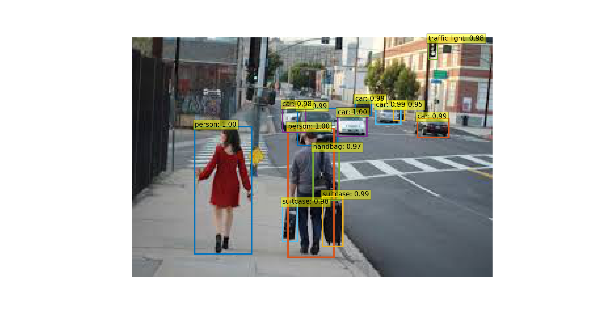

# Simple DETR

This codebase simplifies the access to the DETR model, specifically it provides:

* A configurable `DETR` class which gives you access to different backbones.
  * It inherits from `nn.Module` if you want to mix it with other pytorch code.
* A `predict` method which performs lightweight postprocessing and gives you back bounding boxes and scores.


This codebase takes the code from the [standalone notebook](https://colab.research.google.com/github/facebookresearch/detr/blob/colab/notebooks/detr_demo.ipynb) found on the official [detr](https://github.com/facebookresearch/detr) repo and structures it more like what you would use for a simple deployment or CLI tool.


### Installation
Using pip:
```bash
pip install -r requirements.txt
```

Using poetry:
```bash
poetry install
```

### Evaluating Samples
If you want to play around just with the model just put images in the `test-images` folder and run:

```bash
python main.py
```
This will pop-up matplotlib plots of the images with the bounding box information overlaid:



Options:
```
Usage: main.py [OPTIONS]

Options:
  --images-path PATH (default = test-images)
  --backbone TEXT (default = detr_resnet50)
  --threshold FLOAT (default = 0.7)
  --device TEXT (default = cpu)
```

### API Reference
You can use the `DETR` class on your own Python / PyTorch code. For example:

```python
from detr image DETR
from PIL import Image

model = DETR(backbone="detr_resnet50", threshold=0.7, device="cpu")
image = Image.open("path/to/image.png")
scores, boxes = model.predict(image)
```

#### class DETR
```python
def __init__(
    self,
    threshold: float = 0.7,
    backbone: str = "detr_resnet50",
    device: str = "cpu",
    pretrained: bool = True,
    **kwargs,
):
    """
    Arguments:
        threshold: (float = 0.7) probability threshold required to keep a box.
        backbone: (str = detr_resnet50) one of:
            * detr_resnet50
            * detr_resnet50_dc5
            * detr_resnet101
            * detr_resnet101_dc5
        device: (str = cpu) device to use e.g. "cpu", "cuda", etc
        pretrained: (bool = True) 
        **kwargs: backbone options, for more information see https://github.com/facebookresearch/detr/blob/master/hubconf.py
    """
```

#### DETR.forward
```python
def forward(self, image: torch.Tensor) -> tp.Dict[str, torch.Tensor]:
```

#### DETR.predict
```python
def predict(self, image: Image) -> tp.Tuple[torch.Tensor, torch.Tensor]:
    """
    Calculates the scores and bounding boxes for an image.

    Arguments:
        image: (PIL.Image) image sample.

    Returns:
        (scores, boxes): (Tuple[Tensor, Tensor]) tensors of the scores and boxes.
    """
```


